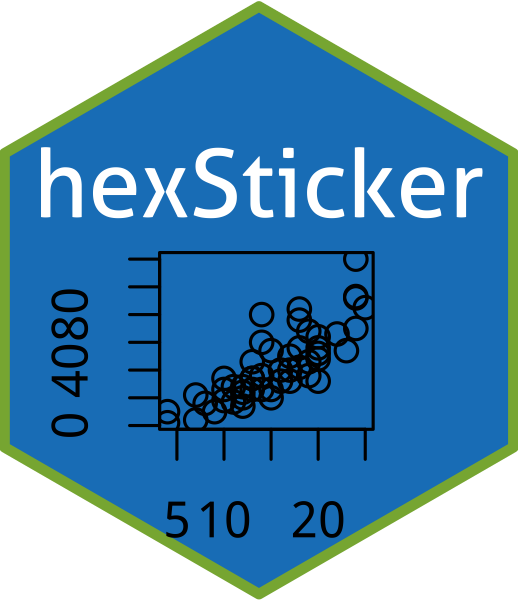
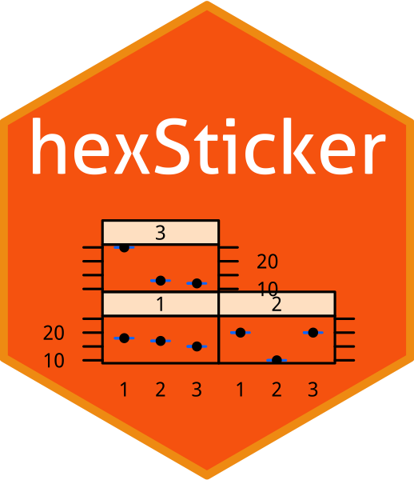

---
output:
  md_document:
    variant: gfm
html_preview: false
---

<!-- README.md is generated from README.Rmd. Please edit that file -->


# hexSticker: create hexagon sticker in R


[](https://cran.r-project.org/package=hexSticker)
[](https://cran.r-project.org/package=hexSticker)
[](https://cran.r-project.org/package=hexSticker)
[](https://cran.r-project.org/package=hexSticker)


```{r echo=FALSE, results="hide", message=FALSE}
library("hexSticker")
```


## :writing_hand: Author

Guangchuang YU <https://guangchuangyu.github.io>

School of Basic Medical Sciences, Southern Medical University


[](https://saythanks.io/to/GuangchuangYu)
`r badger::badge_custom("follow me on", "WeChat", "green", "https://guangchuangyu.github.io/blog_images/biobabble.jpg")`


----

## :arrow_double_down: Installation

Install the hexSticker package via CRAN:

```{r, eval=FALSE}
install.packages("hexSticker")
```

You can also install the package via the Github repository.

```{r, eval=FALSE}
# install.package("remotes")   #In case you have not installed it.
remotes::install_github("GuangchuangYu/hexSticker")
```

## Fail to install

### imageMagick

`imageMagick` is required for installing `hexSticker`.  If you have not installed it, please try the following [approaches](https://www.imagemagick.org/script/download.php).

### Fail to load 'sysfonts'

In Mac OS, you may need to re-install `sysfont` to properly load it.

Be sure to install `xquartz` first.

```{r, eval=FALSE}
brew update && brew install homebrew/cask/xquartz
```

---

## Examples

> `sticker` function will produce a file with dimension exactly for printing according to
> <http://hexb.in/sticker.html>


### base plot

```{r eval=FALSE}
library(hexSticker)
s <- sticker(~plot(cars, cex=.5, cex.axis=.5, mgp=c(0,.3,0), xlab="", ylab=""),
          package="hexSticker", p_size=20, s_x=.8, s_y=.6, s_width=1.4, s_height=1.2,
          filename="inst/figures/baseplot.png")
```

The `sticker()` will generate a figure specify by the `filename` parameter. The output of the `sticker()` function is a `ggplot` object, e.g. the `s` variable in the above example. Print the object, `print(s)`,  will display the image. However, the image may slightly different from the created image file since the graphic device size are different. To solve this issue, `hexSticker` package provides `plot` function to preview sticker. Try `plot(s)` :).



### lattice

```{r fig.keep="none", eval=F}
library(lattice)

counts <- c(18,17,15,20,10,20,25,13,12)
outcome <- gl(3,1,9)
treatment <- gl(3,3)
bwplot <- bwplot(counts ~ outcome | treatment, xlab=NULL, ylab=NULL, cex=.5,
                 scales=list(cex=.5), par.strip.text=list(cex=.5))
sticker(bwplot, package="hexSticker", p_size=20, s_x=1.05, s_y=.8, s_width=2, s_height=1.5,
        h_fill="#f9690e", h_color="#f39c12", filename="inst/figures/lattice.png")
```



### ggplot2

```{r fig.keep="none", eval=F}
library(ggplot2)

p <- ggplot(aes(x = mpg, y = wt), data = mtcars) + geom_point()
p <- p + theme_void() + theme_transparent()

sticker(p, package="hexSticker", p_size=20, s_x=1, s_y=.75, s_width=1.3, s_height=1,
        filename="inst/figures/ggplot2.png")
```


### image file

```{r fig.keep="none", message=FALSE, eval=FALSE}
imgurl <- system.file("figures/cat.png", package="hexSticker")
sticker(imgurl, package="hexSticker", p_size=20, s_x=1, s_y=.75, s_width=.6,
        filename="inst/figures/imgfile.png")
```


### Google fonts

```{r eval=FALSE}
library(showtext)
## Loading Google fonts (http://www.google.com/fonts)
font_add_google("Gochi Hand", "gochi")
## Automatically use showtext to render text for future devices
showtext_auto()

## use the ggplot2 example
sticker(p, package="hexSticker", p_size=22, s_x=1, s_y=.75, s_width=1.3, s_height=1,
        p_family = "gochi", filename="inst/figures/ggplot2-google-font.png")
```


----

## :sparkling_heart: Stickers produced by `hexSticker`

> If you use `hexSticker` and want your sticker to be listed here,
> please feel free to edit [README.Rmd](https://github.com/GuangchuangYu/hexSticker/edit/master/README.Rmd),
> and run `rmarkdown::render("README.Rmd")` in `R` to generate `README.md`.

**Please put stickers in alphabet order.**


### Stickers for software packages

<!--
[]()
-->


[](https://github.com/Bioconductor/BiocStickers/tree/master/AnnotationFilter)
[](https://github.com/lpantano/bcbioSmallRna)
[](https://github.com/bcgov/bcmaps)
[](https://github.com/Bioconductor/BiocStickers/tree/master/BiocFileCache)
[](https://github.com/danielmarcelino/CamaraBR)
[](https://github.com/GuangchuangYu/ChIPseeker)
[](https://github.com/Bioconductor/BiocStickers/tree/master/cleaver)
[](https://github.com/GuangchuangYu/clusterProfiler)
[](https://github.com/stevecondylios/collidr)
[](https://github.com/RhoInc/CRANsearcher)
[](https://github.com/lpantano/DEGreport)
[](https://github.com/tbradley1013/dragondown)
[](https://github.com/CWWhitney/ethnobotanyR)
[](https://github.com/Bioconductor/BiocStickers/tree/master/FamAgg)
[](https://github.com/ipeaGIT/geobr)
[](https://www.samabbott.co.uk/getTBinR/)
[](https://github.com/strengejacke/ggeffects)
[](https://github.com/GuangchuangYu/ggtree)
[](https://github.com/MEDSL/ggmedsl)
[](https://github.com/muschellij2/glassdoor)
[](https://github.com/greta-dev/greta/tree/master/logos)
[](https://github.com/mikemahoney218/heddlr)
[](https://github.com/SteffenMoritz/imputeR)
[](https://github.com/lpantano/isomiRs)
[](https://github.com/wjakethompson/jayhawkdown)
[](https://github.com/graemeleehickey/joineR)
[](https://github.com/graemeleehickey/joineRML)
[](https://github.com/juliasilge/janeaustenr/tree/master/tools)
[](https://github.com/ryansar/lungct)
[](https://github.com/gpaux/Mediana)
[](https://github.com/keblu/MSGARCH)
[](https://github.com/Bioconductor/BiocStickers/tree/master/MSnbase)
[](https://github.com/Bioconductor/BiocStickers/tree/master/mzR)
[](https://github.com/lbenz730/ncaahoopR)
[](https://github.com/asancpt/ncarbe)
[](https://github.com/stevecondylios/netstat)
[](https://github.com/asancpt/NonCompart)
[](https://github.com/emsweene/oasis)
[](https://github.com/EnriquePH/OEIS.R)
[](https://github.com/ox-it/oidnChaRts/tree/master/data-raw)
[](http://github.com/RGLab/openCyto)
[](https://github.com/cbg-ethz/perturbatr)
[](https://uptake.github.io/pkgnet/)
[](https://github.com/dmi3kno/polite)
[](https://github.com/Bioconductor/BiocStickers/tree/master/pRoloc)
[](https://github.com/Bioconductor/BiocStickers/tree/master/pRoloc)
[](https://github.com/Bioconductor/BiocStickers/tree/master/pRoloc)
[](https://github.com/Yue-Jiang/pzfx)
[](https://github.com/justinmillar/r-gators-hex)
[](https://github.com/jwood000/RcppAlgos)
[](https://github.com/potterzot/rnassqs)
[](https://github.com/ellessenne/rsimsum)
[](https://https://github.com/QiHongchao/SampleSize4ClinicalTrials)
[](https://github.com/thiyangt/seer/raw/master/logo/seer.png)
[](https://github.com/danielmarcelino/SenadoBR)
[](https://github.com/sborms/sentometrics)
[](https://github.com/IyarLin/simMixedDAG)
[](https://github.com/Bohdan-Khomtchouk/shinyheatmap)
[](https://github.com/cwthom/shinyhelper)
[](https://github.com/ShixiangWang/sigminer)
[](https://github.com/strengejacke/sjmisc)
[](https://github.com/strengejacke/sjPlot)
[](https://github.com/strengejacke/sjstats)
[](https://github.com/Tazinho/snakecase)
[](https://github.com/danielmarcelino/SoundexBR)
[](https://github.com/pdrhlik/southparkr)
[](https://github.com/rrrlw/TDAstats)
[](https://www.bioconductor.org/packages/treeio)
[](https://github.com/wenlong-liu/usfertilizer)
[](https://github.com/sjmgarnier/viridis)
[](https://github.com/neuroconductor/WhiteStripe)
[](https://github.com/Bioconductor/BiocStickers/tree/master/xcms)
[](https://github.com/drisso/zinb_analysis/tree/master/sticker)


### Stickers for events/workshops

[](https://github.com/Bioconductor/BiocStickers/tree/master/events/CSAMA/2017)
[](https://github.com/Bioconductor/BiocStickers/tree/master/events/CSAMA/2018)
[](https://github.com/Bioconductor/BiocStickers/tree/master/events/EuroBioc2017)

### Stickers for fun

[](https://www.karada-good.net/analyticsr/r-584)

### Stickers for organizations

[](https://github.com/cryptokor)
[](https://github.com/MEDSL/)
[](https://github.com/shinycrypto)
[](https://github.com/slc-rug/slcrug-hexsticker)


## Print/order stickers

Sticker designers can make their stickers available via [Sticker Mule](https://www.stickermule.com/uses/hexagon-stickers).

## Related Tools

+ [badger](https://github.com/GuangchuangYu/badger): Query information and generate badge for using in README and GitHub Pages.
+ [ggimage](https://github.com/GuangchuangYu/ggimage): Supports image files and graphic objects to be visualized in 'ggplot2' graphic system.
+ [meme](https://github.com/GuangchuangYu/meme/): Create Meme.
+ [shadowtext](https://github.com/GuangchuangYu/shadowtext/): Create text grob with background shadow.
